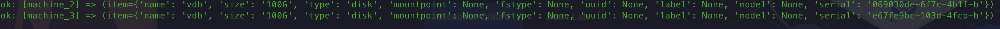
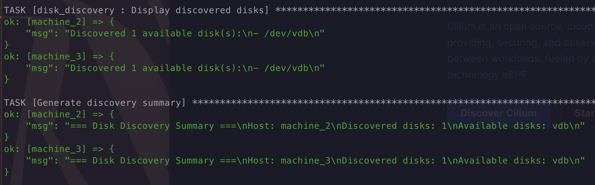
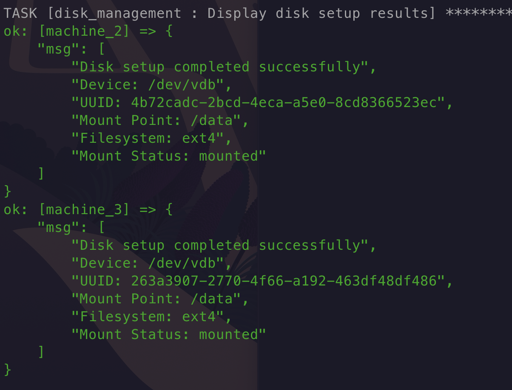

# Ansible auto mount disk to hosts

## Check disk before auto mount
``` 
ansible-playbook playbooks/discover_disks.yml -i inventory/hosts.ini
```




## Mount disk
``` 
ansible-playbook playbooks/add_disks.yml -i inventory/hosts.ini
```

